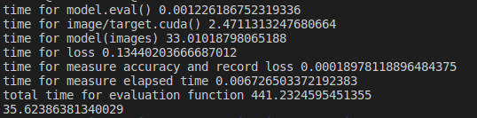

# Introduction
Regardless of evaluating your models on CPU or GPU, it takes some time for evaluation. Knowing how long each part of the evaluation takes to run, can help us not only understand what is going on in the background, but also we can manage the effeciency.
In this repositary, I tried to write a code that shows us which part of the evaluation takes longer. For instance, How long does it take to send all your images to CUDA?, or how long does it take to evaluate them?
You can use this code to measure the time for different models such as AlexNet, ResNet, MobileNet.
I also built another [repositary](https://github.com/mazhej/Model_Op_Count) that count the number of operations (MAC) for each model. Using these two repositary you can calculate the FLOPs for each model, (how many operations they can do in a second).
It seems [MobileNet](https://arxiv.org/abs/1704.04861) is faster than [Resnet](https://arxiv.org/abs/1512.03385) because it has less number of operations. But when we calculate the FLOPs,we can see Resnet models are able to do more operations per second.

## Take Away
MobileNet uses Depthwise Separable Convolutions and Linear Bottlenecks in its architecture, which make it not to be hardware-friendly.

## output
At the end it should give a result like this:

